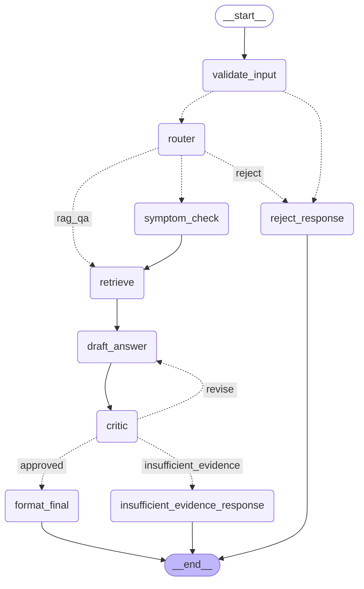

# Agente AI — Functional Medicine RAG + Multi-Agent Assistant

Portfolio project demonstrating a multi-agent, tool-using, RAG-grounded assistant built with
LangGraph and the Gemini API, at $0 infrastructure cost. Domain: functional medicine Q&A,
grounded in a small curated Spanish-language article corpus.

**Live demo:** [4itml79bx2d53juvapoj4o.streamlit.app](https://4itml79bx2d53juvapoj4o.streamlit.app/)

## Quickstart

```bash
pip install -r requirements.txt
pip install -e .
cp .env.example .env   # fill in GEMINI_API_KEY
python -m agente_ai.ingestion.build_index   # builds the local Chroma index
streamlit run streamlit_app.py
```

Run the tests (fully mocked, no API key needed) and the evals (hits the real API):

```bash
pytest tests/ -v
python evals/run_evals.py
```

> **Local dev note (Windows):** if this repo lives under a OneDrive-synced folder, `pip
> install -e .` can fail while creating `*.egg-info` (OneDrive intercepts the file write).
> Skip the editable install and set `PYTHONPATH` to `src` instead before running any command:
> `$env:PYTHONPATH = "src"` (PowerShell) or `export PYTHONPATH=src` (bash). Not needed in
> Docker/CI/deploy, where this constraint doesn't apply. `tests/` doesn't need this — a
> `conftest.py` at the repo root inserts `src/` onto `sys.path` for pytest automatically.

## Architecture

Multi-agent LangGraph pipeline — router picks a path, retrieval and an optional deterministic
tool ground the answer, and a critic checks the draft before it ever reaches the user:



_(Generated straight from the compiled graph via `graph.get_graph().draw_mermaid()` — it's
always in sync with the actual wiring in `src/agente_ai/graph/build_graph.py`.)_

- **router**: classifies the query into `rag_qa` / `symptom_check` / `reject` (structured
  Gemini output, `src/agente_ai/graph/schemas.py:RouteDecision`).
- **retrieve**: RAG-as-tool over a Chroma index of the corpus.
- **symptom_check**: a deterministic, non-LLM tool (`src/agente_ai/tools/symptom_checker_tool.py`)
  mapping reported symptoms to a functional-medicine axis; composes with retrieval.
- **critic**: verifies the draft is grounded in retrieved context before it reaches the user,
  sending it back for revision (capped at 2 retries) or admitting insufficient evidence rather
  than risk a hallucinated answer.

See the implementation plan for full design rationale.

## Model notes

Uses `gemini-flash-lite-latest` for generation, not `gemini-flash-latest`: the "latest" alias
currently resolves to a newer model capped at 20 free-tier requests/day on this account, which
evals running in CI would blow through immediately. The lite model also has no "thinking" step,
so it doesn't burn output-token budget on invisible reasoning before answering — but its own
free tier caps at **15 requests/minute**, which `evals/run_evals.py` paces around
(`config.EVAL_PACING_SECONDS`) rather than relying solely on `llm_client.call_with_retry`'s
backoff.

## Evals

`evals/golden_set.jsonl` holds 10 hand-written cases (one per corpus topic, plus one
symptom-check case and one off-topic rejection case). `evals/run_evals.py` runs each through
the compiled graph and checks:

- **routing correctness** — did the router pick the expected path?
- **retrieval precision** — did retrieval hit the expected source document (`doc_id`)?
- **tool usage** — did the expected tool fire (e.g. the symptom checker)?
- **faithfulness / relevance** — scored 1-5 by Gemini itself as an LLM judge, comparing the
  final answer against the retrieved context.

Writes `evals/results.json` and exits non-zero if average faithfulness drops below
`config.FAITHFULNESS_THRESHOLD` (4.0) — this is the CI gate in `.github/workflows/evals.yml`.
`.github/workflows/ci.yml` runs lint + the fully-mocked unit test suite on every push,
independent of API quota. Latest CI run: **100% routing accuracy, 5.00/5 faithfulness**
across the full golden set.

## Observability

`src/agente_ai/observability/logger.py` provides a `@log_node` decorator (applied to every
graph node in `nodes.py`) that times execution and emits one structured JSON log line per node
call — to stdout always, and to a local `agent.jsonl` file when possible (see `LOG_DIR` in
`config.py` — defaults outside this repo's folder on this dev machine for the same OneDrive
reason as `CHROMA_DATA_DIR`). The Streamlit UI's "Ver traza del agente" expander renders the
same per-run trace live.

## Guardrails

- Input validation (`validate_input` node) rejects empty/too-short queries before any LLM call.
- The `critic` node is the output guardrail: nothing reaches the user without being checked
  against retrieved evidence first.
- `revision_count` is capped (`config.MAX_REVISIONS`) so the draft↔critic loop always
  terminates.
- `llm_client.call_with_retry` wraps every Gemini call with exponential backoff.
- Retrieved context is capped at `MAX_CONTEXT_CHARS` before being placed in a prompt.

## Deployment

**Live**: deployed on Streamlit Community Cloud at
[4itml79bx2d53juvapoj4o.streamlit.app](https://4itml79bx2d53juvapoj4o.streamlit.app/), tracking
the `main` branch.

**Docker** (local reproducibility / alternate hosts):

```bash
docker build --build-arg GEMINI_API_KEY=<your-key> -t agente-ai .
docker run -p 8501:8501 -e GEMINI_API_KEY=<your-key> agente-ai
```

The image bakes the Chroma index in at build time. Not required for Streamlit Community Cloud
(it installs `requirements.txt` and runs `streamlit_app.py` directly), but useful for local
repro or a Docker-based host (e.g. an HF Spaces Docker Space).

**Streamlit Community Cloud setup** (for reference / redeploying elsewhere):

1. Push this repo to a public GitHub repository.
2. Go to [share.streamlit.io](https://share.streamlit.io), sign in with GitHub, "New app".
3. Pick the repo, branch `main`, main file path `streamlit_app.py`.
4. In the app's Settings → Secrets, add:
   ```toml
   GEMINI_API_KEY = "your-key-here"
   ```
5. In Settings → Sharing, set the app to public (otherwise it defaults to invite-only).
6. Deploy. First load will lazy-build the Chroma index (see `ensure_index_built()` in
   `streamlit_app.py`) since the platform's filesystem doesn't persist the baked-in Docker
   image — this makes every fresh deploy self-healing without a separate "publish index" step.
